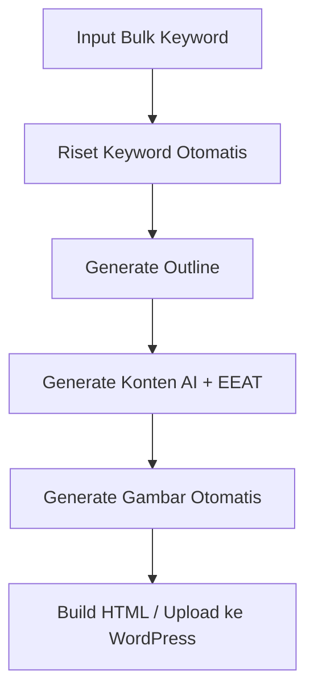

# Ternak-content
Berikut adalah README.md profesional untuk proyek software otomatisasi content generation yang kamu rancang. Sudah disiapkan agar bisa langsung dieksekusi atau disuruh ke AI untuk dikembangkan lebih lanjut. Termasuk:

Riset keyword (bulk input)

Konten teks dengan E-E-A-T

Gambar dari API AI + stok gratis

Output HTML / WordPress

Siap dijadikan MicroSaaS


---

# 🧠 Auto Content Generator with E-E-A-T + Bulk Keyword Input

Sebuah sistem otomatisasi lengkap untuk membuat konten SEO-friendly berbasis E-E-A-T, lengkap dengan riset keyword, pembuatan konten teks dan gambar, dan publikasi ke berbagai platform (WordPress, HTML statis, dll).

---

## ✨ Fitur Utama

- ✅ **Bulk Keyword Input** — Masukkan banyak keyword sekaligus (CSV / textarea)
- ✅ **Automated Keyword Research** — Gunakan SERP scraping, keyword suggestion tools, atau API
- ✅ **Content Outline Generation** — Buat struktur H1-H3, FAQ, dan listicle
- ✅ **Content Generation with E-E-A-T** — AI-generated text yang menyimulasikan pengalaman & otoritas
- ✅ **Gambar Otomatis**
  - 🎨 AI Image (DALL·E / SD / Invoke)
  - 📷 Free Stock API: Unsplash, Pixabay, Pexels
- ✅ **Export Options**
  - Simpan sebagai HTML, Markdown
  - Upload via WordPress REST API atau Blogspot API
- ✅ **Modular System** — Mudah dikembangkan jadi SaaS / CLI tool

---

## 🚀 Cara Kerja



---

## ⚙️ Teknologi yang Digunakan

| Komponen | Teknologi |
|----------|-----------|
| Backend | Python 3.11+ (FastAPI / Flask) |
| AI Teks | OpenAI GPT-4 / Local LLM |
| Gambar AI | DALL·E, Stable Diffusion |
| Gambar Stock | Unsplash API, Pixabay API, Pexels API |
| Database | SQLite / Postgres |
| Frontend Opsional | React / Astro |
| Publish | WordPress API, Blogspot API, Static HTML |
| Automation | Cron + Celery |

---

## 📥 Instalasi

```bash
# Clone repository
git clone https://github.com/namamu/auto-content-eeat.git
cd auto-content-eeat

# Install dependencies
pip install -r requirements.txt

# Copy environment file
cp .env.example .env
```

Tambahkan file `.env`:

```env
OPENAI_API_KEY=your_openai_key
UNSPLASH_API_KEY=your_unsplash_key
PIXABAY_API_KEY=your_pixabay_key
PEXELS_API_KEY=your_pexels_key
WORDPRESS_URL=https://yourdomain.com
WORDPRESS_USER=your_user
WORDPRESS_APP_PASSWORD=xxxxx
```

---

## 🚀 Cara Penggunaan

### 1. Web Interface

```bash
# Jalankan server
python main.py

# Buka browser
http://localhost:8000
```

### 2. CLI Tool

```bash
# Single keyword
python cli.py --keyword "diet sehat"

# Multiple keywords
python cli.py --keywords "diet sehat" "tips menurunkan berat badan"

# CSV file
python cli.py --csv sample_keywords.csv

# Publish to WordPress
python cli.py --csv sample_keywords.csv --wordpress

# Test WordPress connection
python cli.py --test
```

### 3. API Endpoints

```bash
# Upload CSV
curl -X POST -F "file=@sample_keywords.csv" http://localhost:8000/upload-keywords

# Process keywords
curl -X POST -H "Content-Type: application/json" \
  -d '{"keywords": ["diet sehat", "tips menurunkan berat badan"]}' \
  http://localhost:8000/process-keywords

# Publish to WordPress
curl -X POST -H "Content-Type: application/json" \
  -d '{"keyword": "diet sehat", "content": "<html>...</html>"}' \
  http://localhost:8000/publish-wordpress
```

---

## 📝 Format Input Keyword

### 1. Melalui file CSV:

```csv
keyword,description
diet sehat,Panduan diet sehat untuk pemula
tips menurunkan berat badan,Cara efektif menurunkan berat badan
makanan tinggi protein,Daftar makanan sumber protein terbaik
```

### 2. Atau via input textarea:

```
diet sehat
tips menurunkan berat badan
makanan tinggi protein
```

---

## 🖼️ Contoh Gambar API Integration

### Unsplash:
```
Endpoint: https://api.unsplash.com/search/photos?query={keyword}
Auth: Authorization: Client-ID {API_KEY}
```

### Pixabay:
```
https://pixabay.com/api/?key={API_KEY}&q={keyword}
```

### Pexels:
```
https://api.pexels.com/v1/search?query={keyword}
```

---

## 📤 Export/Publish Output

`output/` folder akan menyimpan:

- `artikel.html`
- `gambar.jpg`
- `meta.json`

Untuk WordPress:
- Post via REST API

Untuk static site:
- Bisa deploy ke Vercel / Netlify

---

## 📚 TO-DO dan Modul yang Akan Dibuat

| Modul | Status |
|-------|--------|
| Bulk Keyword Input | ✅ |
| Keyword Scraper / API | ✅ |
| Outline Generator | ✅ |
| Article Writer with E-E-A-T | ✅ |
| Gambar AI & Stock | ✅ |
| Export HTML / WordPress API | ✅ |
| UI Dashboard | ✅ |
| CLI Tool | ✅ |
| Scheduler Automation | ⏳ |

---

## 🧠 Tips Penggunaan

1. **Gunakan prompt spesifik untuk E-E-A-T** agar AI menyimulasikan keahlian nyata
2. **Tambahkan "author profile"** untuk meningkatkan trust
3. **Kombinasikan dengan plugin SEO** seperti RankMath di WordPress untuk hasil maksimal

---

## 💡 Contoh Prompt (GPT)

```
Tuliskan artikel informatif, bernada profesional dan meyakinkan, tentang 'Tips Diet Sehat'. 
Sertakan studi kasus, data ilmiah, dan kutipan dari sumber terpercaya. 
Gunakan gaya bahasa seperti seorang ahli gizi.
```

---

## 🏗️ Struktur Proyek

```
auto-content-eeat/
├── main.py                 # FastAPI application
├── cli.py                  # CLI tool
├── requirements.txt        # Dependencies
├── .env.example           # Environment template
├── sample_keywords.csv    # Sample keywords
├── src/
│   ├── modules/
│   │   ├── keyword_research.py
│   │   ├── content_generator.py
│   │   ├── image_generator.py
│   │   └── wordpress_publisher.py
│   └── utils/
│       └── config.py
├── templates/
│   └── index.html         # Web interface
├── static/                # Static files
└── output/               # Generated content
```

---

## 💼 Lisensi

MIT — Gratis digunakan, dimodifikasi, dan dikomersialkan.

---

## 🤝 Kontribusi

Ingin bantu? Boleh!

- Tambahkan modul baru
- Buatkan versi UI
- Buat plugin ke platform lain (Substack, Medium)

---

## 📬 Kontak

- Telegram: @namamu
- Email: your@email.com

---

## ✅ Siap digunakan ke AI

Kamu tinggal beri perintah:

> "Gunakan README ini, dan buat semua modul satu per satu. Mulai dari keyword input dan scraping."

Kalau kamu mau, saya bisa bantu langsung buatkan struktur folder Python + `main.py` untuk modul pertama (`bulk keyword + riset`). Ingin lanjut dari situ?

